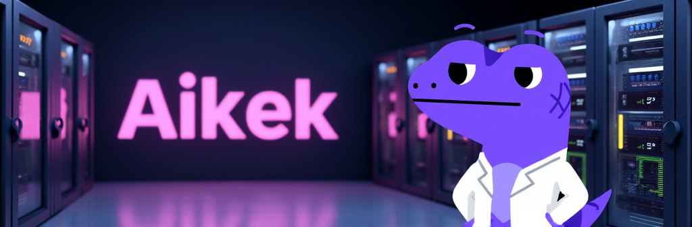

# Case Studies

AIKEK's AI infrastructure serves a wide range of projects, applications, and use cases.

* If you're a protocol, framework, or agentic swarm looking for crypto-native AI building blocks, see [#coingecko](case-studies.md#coingecko "mention") and [#virtuals-protocol](case-studies.md#virtuals-protocol "mention").
* If you're an aggregator seeking unique multimodal AI models to strengthen your offering, see [#vertical-ai](case-studies.md#vertical-ai "mention").
* If you're an ecosystem seeking to create an AI platform for your builders, add utility, and unlock hidden synergies, see [#pudgy-penguins](case-studies.md#pudgy-penguins "mention").
* If you're a memecoin seeking to scale content and get more mindshare, see [#brett](case-studies.md#brett "mention") and [#non-playable-coin-npc](case-studies.md#non-playable-coin-npc "mention").


&#x20;[Contact us](https://t.me/alphakek_chat) or [apply here](https://forms.gle/1qX76A98uUb6B9JV9) to build your own unique AI ecosystem using AIKEK's infrastructure.


***

## CoinGecko

<figure><figcaption></figcaption></figure>

### Goal

Phase 1 of AIKEK's work with CoinGecko begins with an AI platform for their internal team use, designed to scale their content, brand, and marketing efforts. AIKEK is doing more AI R\&D with CoinGecko, as a part of AIKEK's new upcoming platform, codename [Fractal 2.0](guides/glossary.md).

### Results

* [Phase 1 platform output](https://x.com/coingecko/status/1963891936294805643)

### Announcements

* [CoinGecko partnership announcement](https://x.com/coingecko/status/1963892012165554389)

***

## Virtuals Protocol

<figure><figcaption></figcaption></figure>

### Goal

AIKEK became a core agent in [Virtuals Protocol](https://x.com/virtuals_io)'s [Agent Commerce Protocol](https://x.com/virtuals_io/status/1892205912150114577) (ACP), offering generative memes, media, and narratives that scale. ACP is a new agent-to-agent economy, organizing the best autonomous agents into clusters that operate full businesses. Given AIKEK's early innovations and expertise in [generative graphics](https://x.com/alphakek_ai/status/1922707613252452633), this was a perfect fit. Later, AIKEK's role will expand to infra that supports multi-agent workflows.

### Solution

[#meme-generation](launch/ai-agents/#meme-generation "mention")

* Scalable, crypto-aware, and autonomous content generation, working on the Media House cluster alongside Luna
* Many new businesses in the agentic economy launch with little to no visual identity
* AIKEK is developing One-Shot Memes (previously "Remix"), a new way for any project to generate memes and other visuals
  * Projects can scale their content using minimal branding assets
  * On-brand, contextual visuals using only a single reference logo, mascot, or image
  * While staying aligned with current trends and narrative cycles
* In parallel, AIKEK is training more "universal" image generation models to support more creators and more platforms

[#aikek-memelord](launch/universal-agents.md#aikek-memelord "mention")

* Belongs to AIKEK's family of [universal-agents.md](launch/universal-agents.md "mention") that can integrate with any platform, anywhere
* Available via [memelord-api.md](developers/memelord-api.md "mention")

### Results

* Coming soon

### Announcements

* [ACP announcement (DAWN)](https://x.com/zer0xdawn/status/1902075197009883559)
* [ACP overview](https://x.com/alphakek_ai/status/1907129290350878903)
* [Media Cluster overview (DAWN)](https://x.com/zer0xdawn/status/1906788257834356961)
* [ACP Phase 1 update (DAWN)](https://x.com/zer0xdawn/status/1917374499902873974)
* [ACP Remix update](https://x.com/alphakek_ai/status/1920870425304985955)
* [ACP One-Shot Memes update](https://x.com/zer0xdawn/status/1927411978034717104)

***

## Vertical AI

<figure><figcaption></figcaption></figure>

### **Goal**

[Vertical AI](https://x.com/Build_Vertical) is a no-code platform and marketplace for training, deploying, and monetizing AI models. AIKEK builds custom, zeroslop AI models. They contacted us with a clear goal in mind. Make unique, crypto-native AI models more accessible to the masses.

### Solution

[#meme-generation](launch/ai-agents/#meme-generation "mention")

* Integrated AIKEK's [universal-agents.md](launch/universal-agents.md "mention") to access the beloved [AIKEK Meme Model](https://x.com/alphakek_ai/status/1874214281300054272), a crypto context-aware image model trained on thousands of curated 4chan memes
* Vertical AI's 10k+ registered users now have access to the model in Vertical Studio, in one click
* Has been a big hit in Vertical AI's community and is being used for their meme contests

[#aikek-memelord](launch/universal-agents.md#aikek-memelord "mention")

* Belongs to AIKEK's family of [universal-agents.md](launch/universal-agents.md "mention") that can integrate with any platform, anywhere
* Available via [memelord-api.md](developers/memelord-api.md "mention")
* More AI models will be avaliable via Universal Agents and accessible to Vertical AI in the near future

### Results

* "Your meme generator is a huge hit in our community, we love it!" —Hidde van Neerbos, Head of Marketing
* [AIKEK-powered Meme Contest](https://x.com/Build_Vertical/status/1902693313754345874)

### Announcements

* [Memelord API Integration announcement](https://x.com/Build_Vertical/status/1898117085538271503)
* [Memelord API Integration launch](https://x.com/alphakek_ai/status/1899466146623226175)
* [Vertical AI Studio web app](https://app.verticalstudio.ai/stream/alphakek-meme-generator)
* [AIKEK Meme Model launch](https://x.com/alphakek_ai/status/1874214281300054272) (previously "4chan style")
* [AIKEK Meme Model highlights](https://x.com/alphakek_ai/status/1874867344088207633)

***

## Pudgy Penguins

<figure><figcaption></figcaption></figure>

### Goal

Luca famously predicted that "who controls the memes controls the universe". For Pudgy Penguins and PENGU, AIKEK developed a suite of AI public goods for community members and builders. It's an ecosystem where memes breathe data, real-time data fuels memes, and the Pudgy Penguins community seizes the memes of production in one unified engine. The journey began in October 2024 when Pudgy’s leadership, [Aaron](https://x.com/AaronTeng?ref=blog.alphakek.ai) and [FoxyPenguin](https://x.com/FoxyPenguinApe?ref=blog.alphakek.ai), tasked us with further developing AIKEK's experimental [Pudgy AI v1 model](https://x.com/alphakek_ai/status/1850483099978899641).

<figure><figcaption>
Pudgy AI Ecosystem overview
</figcaption></figure>

### Solution

[#meme-generation](launch/ai-agents/#meme-generation "mention")

* Custom [meme-generator.md](create/meme-generator.md "mention") for scaling Pudgy Penguins content
* Trained on huge public and private dataset of Pudgy Penguins memes
* Available in the official PENGU Telegram, [Pengu Army](https://t.me/pengutg), and in [Pengu AI Bot](https://t.me/PenguAIBot)
* All generated memes are automatically posted in the [Pudgy AI Lab](https://t.me/pudgyailab), a convenient public meme repository
* The [Twitter Banner Generator](https://x.com/alphakek_ai/status/1901554451103834347) allows the Pudgy community to create Pudgy-themed banners for their X profiles for any theme, campaign, or meta, using command /banner

[prompt-enhancer.md](create/prompt-enhancer.md "mention")

* Pudgy Penguins requires a unique level of consistency, curation, and quality control
* We developed a new NSFW and quality control filter to ensure all output is family-friendly and on-brand

[universal-agents.md](launch/universal-agents.md "mention")

* To enable AI-powered research of Pudgy Penguins and PENGU-related data, including onchain analysis, offchain news, and social sentiment, we started automatically collecting data in [fractal.md](fractal.md "mention") and making it available via [#aikek-wizard](launch/universal-agents.md#aikek-wizard "mention")
* The Pudgy meme model is also available to Pudgy Penguins builders via [#aikek-memelord](launch/universal-agents.md#aikek-memelord "mention")
* Both APIs are subject to Pudgy team approval

### Results

* [Meme Generator highlights](https://x.com/alphakek_ai/status/1905575886352679374)
* [3,000 Memes Generated](https://x.com/alphakek_ai/status/1924402872177057845)
* [Aaron Teng (CEO, Igloo Asia)](https://x.com/AaronTeng/status/1924452158239555717)
* [Ross Stephenson (Igloo Asia)](https://x.com/magicross7/status/1889935747626705069)
* [OPPA (Pudgy Malaysia Council)](https://x.com/oppawannadoyou/status/1901593267395002791)
* [Betty (Igloo Asia)](https://x.com/bettymakesit/status/1899020322327916991)
* [Suenwins (Igloo Asia)](https://x.com/Suenwins/status/1898951259769749562)
* [Pudgy Penguins Russia](https://x.com/PudgyRussia/status/1917548194071748744)
* [FoxyPenguin (Head of Asia)](https://x.com/FoxyPenguinApe/status/1922407053949030861)

### Announcements

* [Meme Generator announcement](https://x.com/Berko_Crypto/status/1850575513791897740)
* [Meme Generator launch](https://x.com/alphakek_ai/status/1850483099978899641)
* [Meme Generator blog post](https://blog.alphakek.ai/introducing-pudgy-ai/)
* [AI Ecosystem launch](https://x.com/alphakek_ai/status/1901554451103834347)
* [Meme Generator v2 launch](https://x.com/alphakek_ai/status/1904468760251253211)
* [Pengu Community Tools launch](https://x.com/alphakek_ai/status/1916838810912231669)

***

## Brett

<figure><figcaption></figcaption></figure>

### Goal

[Brett](https://x.com/BasedBrett), the Base chain blue chip meme, is a frequent AIKEK collaborator. The Brett team initially needed to generate content more efficiently for their Chinese community, later utilizing AIKEK for their main community and socials. Develpment on the first custom Brett AI model began in August 2024.

### Solution

[#meme-generation](launch/ai-agents/#meme-generation "mention")

* Custom [meme-generator.md](create/meme-generator.md "mention") for scaling Brett content
* Trained on large dataset of Brett illustrations
* Available in Brett's official [Telegram](https://t.me/basedbrett)

[ai-agents](launch/ai-agents/ "mention")

* Launched [Agent Brett](https://x.com/BasedBrettAI) as part of AIKEK's [agent-swarm.md](launch/ai-agents/agent-swarm.md "mention")
* Autonomously memes real-time news, trends, and metas
* 24/7 Base onchain analysis coming in Phase 2
* Powered by AIKEK's knowledge engine [fractal.md](fractal.md "mention")

[prompt-enhancer.md](create/prompt-enhancer.md "mention")

* Automatically enhancing user prompts for maximum fidelity, detail, and context
* Automatically enhancing Agent Brett memes and adding real-time crypto context

### Results

* [Meme Generator highlights](https://x.com/alphakek_ai/status/1840365854963454127)
* [Meme Generator v2 highlights](https://x.com/alphakek_ai/status/1895785058658894300)

### Announcements

* [Meme Generator announcement](https://x.com/BasedBrett/status/1842047092065198287)
* [Meme Generator launch](https://x.com/alphakek_ai/status/1839418435643875640)
* [Meme Generator blog post](https://blog.alphakek.ai/developing-brett-ai/)
* [Prompt Enhancer launch](https://x.com/alphakek_ai/status/1886127314398072900)
* [Meme Generator v2 launch](https://x.com/alphakek_ai/status/1895489594004812214)
* [Agent launch](https://x.com/alphakek_ai/status/1900347688815911139)

***

## Non-Playable Coin (NPC)

<figure><figcaption></figcaption></figure>

### Goal

The [NPC](https://x.com/NonPlayableCoin) team began their gray domination by being early adopters of AI tech and experimental tech. They contacted us because they needed flexible AI building blocks to power their wide range of tools and applications, especially given NPC's lore as a visual storyteller and social commentator.

### Solution

[#meme-generation](launch/ai-agents/#meme-generation "mention")

* Custom [meme-generator.md](create/meme-generator.md "mention") for scaling NPC content
* Trained on large dataset of NPC memes
* Available in NPC's official [Telegram](https://t.me/basedbrett)

[#aikek-memelord](launch/universal-agents.md#aikek-memelord "mention")

* Currently powers NPC's meme generator [web application](https://www.npc.com/ai)
* API includes [prompt-enhancer.md](create/prompt-enhancer.md "mention")

[ai-agents](launch/ai-agents/ "mention")

* Launched [Agent Brett](https://x.com/BasedBrettAI) as part of AIKEK's [agent-swarm.md](launch/ai-agents/agent-swarm.md "mention")
* Autonomously memes real-time news, trends, and metas
* Powered by AIKEK's knowledge engine [fractal.md](fractal.md "mention")

### Results

* [Meme Generator highlights](https://x.com/alphakek_ai/status/1860918693791994224)
* [Meme Generator v2 highlights](https://x.com/NonPlayableCoin/status/1901884172878135580)

### Announcements

* [Meme Generator launch](https://x.com/alphakek_ai/status/1860735335640322294)
* [Meme Generator Website announcement](https://x.com/NonPlayableCoin/status/1862196961593500136)
* [Meme Generator Website launch](https://x.com/alphakek_ai/status/1862407705228714113)
* [Agent NPC announcement](https://x.com/NonPlayableCoin/status/1876344252134986095)
* [Agent NPC launch](https://x.com/alphakek_ai/status/1877400066992042469)
* [Meme Generator v2 launch](https://x.com/alphakek_ai/status/1901706529159393787)
