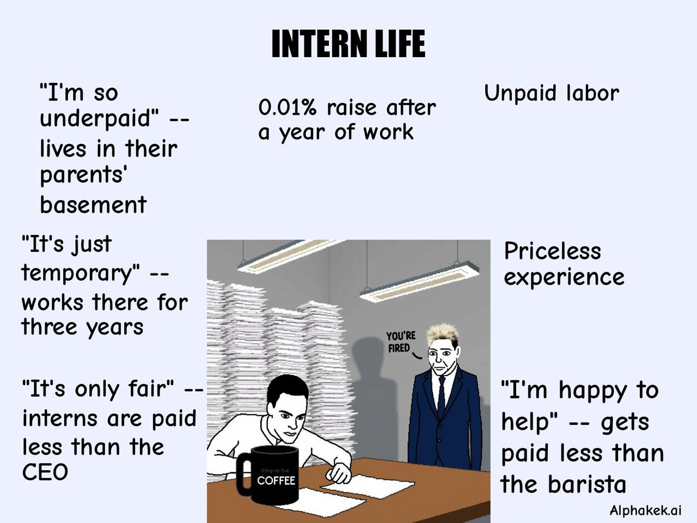
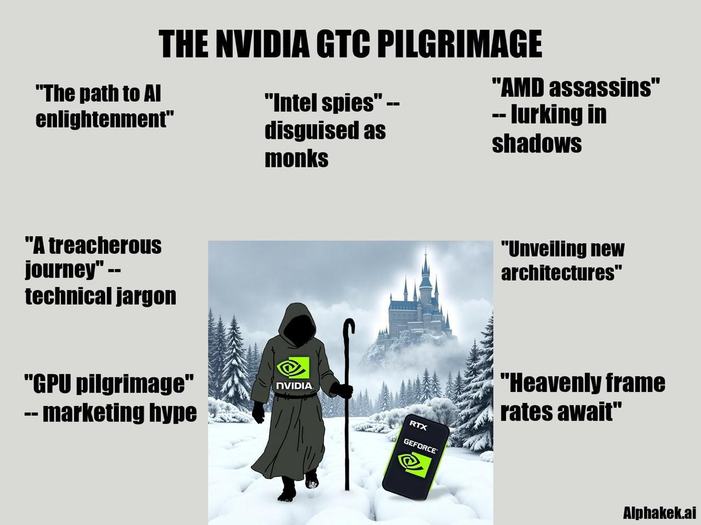
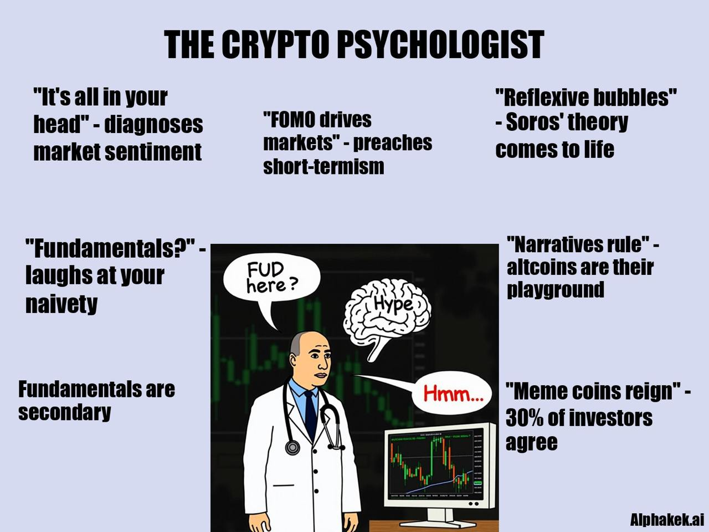

# Caption Meme

This pipeline takes a text description and an optional image as input and then generates a caption meme automatically, leveraging [Fractal](../fractal.md)'s real-time data. Use [command](../guides/bot-commands.md) `/meme`.

<figure><figcaption></figcaption></figure>

<figure><figcaption></figcaption></figure>

<figure><figcaption></figcaption></figure>

Features:

* **Central Figure:** A simple, cartoonish or symbolic character, often representing a stereotypical person or viewpoint.
* **Multiple Captions:** The surrounding text consists of short, punchy statements that encapsulate contradictions, hypocrisy, or other commentary related to the figure.
* **Juxtaposition of Ideas:** Each caption presents contrasting or ironic statements, exaggerating certain beliefs or attitudes in a humorous way.
