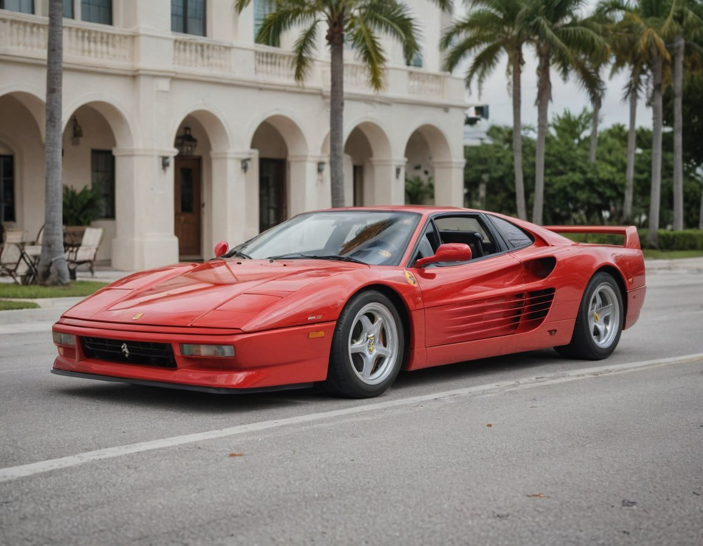
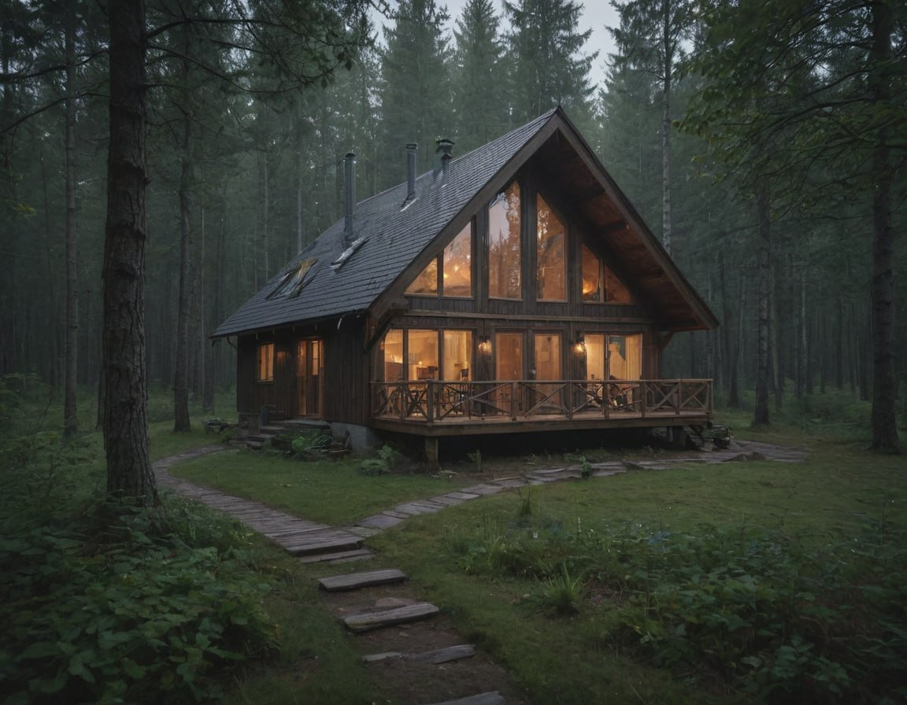
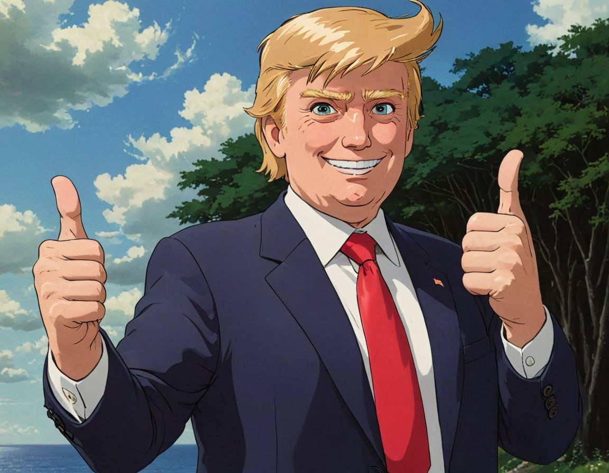

# Text-to-Image

All text-to-image [bot-commands.md](../guides/bot-commands.md "mention") are:&#x20;

* `/image prompt_text` - standard image
* `/imagev prompt_text` - vertical image
* `/imagew prompt_text` - wide image, 3:1
* `/imagesq prompt_text` - square image; 1:1

Example: `/image brett drinking coffee at a cafe and saying "gm"`

## Parameters

***

You can also add Parameters at the beginning of the prompt. Multiple parameters per prompt is supported. Example: `/image -raw -logo brett drinking coffee at a cafe and saying ((("gm")))`

Keyword Strength

Adjust keyword strength is to use `()` and `[]`. `(keyword)` increases the strength of the keyword by a factor of 1.1 and is the same as `(keyword:1.1)`. `[keyword]` decrease the strength by a factor of 0.9 and is the same as `(keyword:0.9)`.

You can use multiple of them, just like in algebra. The effect is multiplicative.

* (keyword) is equivalent to (keyword: 1.1)
* ((keyword)) is equivalent to (keyword: 1.21)
* (((keyword))) is equivalent to (keyword: 1.33)

Similarly, the effects of using multiple `[]` are:

* \[keyword] is equivalent to (keyword: 0.9)
* \[\[keyword]] is equivalent to (keyword: 0.81)
* \[\[\[keyword]]] is equivalent to (keyword: 0.73)

Example: `/image (((Phil))) dressed as a tiny vampire, standing under a full moon, surrounded by bats and glowing pumpkins, in a foggy graveyard ((distorted perspective, unique perspective, side profile, viewed from above, (ultra-wide angle lens), vanishing point))`

Aspect Ratio

`-ar` and `--ar` change the aspect ratio of an image. `-ar 1:1` will produce a square image, `-ar 16:9` will generate a standard wide image. Values from `-ar 4:1` to `-ar 1:4` are supported.

Batch Generation

We currently offer Batch Generation to [Elite tier](../guides/user-tiers.md#alpha-visuals) users.

`-n` and `--n` change the number of images to generate per command. For example, `/image anime cat -n 2` will generate two images.

Override/Enable Prompt Enhancer

Want to manually bypass [prompt-enhancer.md](prompt-enhancer.md "mention") for your short prompts? If your prompt is 350 characters or less and you want to use it as is, add the parameter `-raw`.

To activate Prompt Enhancer for long prompts, add the parameter `-p`.

Watermark

You are an $AIKEK whale but want a watermark on your images?&#x20;

Just add the parameter `-logo`

## Best Practices

***

The new [prompt-enhancer.md](prompt-enhancer.md "mention") is now enabled in our bot by default, automatically giving you detailed, high quality prompts every time.

Describe, don't direct

Describe the image you want to see rather than instructing it directly to draw or illustrate. Just provide vivid details of the scene, and the AI will interpret them into a visual output

❌ Don't: `/image` draw a cat sitting by the window

✅ Do: `/image` a fluffy cat sitting by a sunlit window, gazing outside with a calm expression

❌ Don't: `/image` draw a picture of brett, add a mountain in the background

✅ Do: `/image` Brett stands triumphantly on the peak of a rugged mountain. His broad shoulders and powerful arms are bare, except for tattered blue jeans that cling to his frame, torn from his intense journey to the top. Snow and wind swirl around him, yet he remains unfazed, his gaze fixed on the vast, breathtaking horizon.

.

Stick to visual details

Focus only on visual elements rather than conceptual or background information about the characters or scene. The AI doesn’t interpret relationships, histories, or abstract concepts—it generates based solely on what you describe visually.

❌ Don't: `/image` brett is the father of vitalik buterin

✅ Do: `/image` brett standing next to vitalik buterin

Be detailed

The more details in the prompt, the better.

✅ Do: `/image` (((Phil))) dressed as a tiny vampire, standing under a full moon, surrounded by bats and glowing pumpkins, in a foggy graveyard ((distorted perspective, unique perspective, side profile, viewed from above, (ultra-wide angle lens), vanishing point))

Quotes only for visible text

Don’t use quotation marks around the entire prompt. Quotation marks can confuse the AI, making it think you want the text itself to appear in the image. Only use quotes for specific text you want shown within the image (e.g., a sign or ticker).

❌ Don't: `/image` "Phil dressed as a werewolf, howling playfully at the full moon, standing on a cliff with misty mountains and eerie forests in the background"

✅ Do: `/image` Phil dressed as a werewolf, howling playfully at the full moon, standing on a cliff with misty mountains and eerie forests in the background

## Examples

***

<figure><figcaption>
Prompt: <code>Donald Trump skibidi toilet standing next to a matte green Mercedes G63 AMG, 8bit</code>
</figcaption></figure>

<figure><figcaption>
Prompt: <code>Classic red Ferrari Testarossa parked in front of a large white mansion with a palm-lined driveway</code>
</figcaption></figure>

<figure><figcaption>
Prompt: <code>Cozy cabin nestled in a misty, dense forest at twilight</code>
</figcaption></figure>

<figure><figcaption>
Prompt: <code>Donald Trump cheerful with lush green backdrop studio ghibli style</code>
</figcaption></figure>

View a full list of our public custom AI models:


[meme-models.md](meme-models.md)

