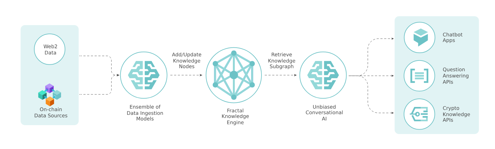

# Knowledge Swarms

<figure><figcaption>
Overview of Fractal, our knowledge engine.
</figcaption></figure>

Knowledge Swarms are **AI knowledge engines** tailored to your project’s unique data. It aggregates, synthesizes, and updates information from public/private sources (news, on-chain activity, social media, docs) into a unified system accessible via APIs, AI agents, or applications.

**Think of it as:**

* A self-updating, high-context “brain” for your project or topic.
* A scalable alternative to static knowledge bases or brittle RAG pipelines.

Built on [fractal.md](../fractal.md "mention"), our proprietary knowledge engine that removes redundancy and ensures real-time accuracy.

## How It Works

***

1. **Define Scope:**
   * Identify your data needs and sources for ingestion
   * For example: Learn Pudgy Penguins ecosystem updates, US stock news, or BNB Chain developer activity.
2. **Pipeline Setup:**
   * Public Sources: News, social media, blockchain transactions.
   * Private Sources: Internal docs, proprietary APIs.
   * New Sources: Integrate new APIs or sites.
3. **Fractal Integration**
   * [fractal.md](../fractal.md "mention") groups related data into subgraphs, e.g. all Pudgy Penguin trades + related tweets + lore updates.
   * Updates subgraphs in real-time as data changes.
4. **Model Training**
   * Your AI model connects to the knowledge engine, learning from Fractal’s structured subgraphs.
5. **Deployment**
   * Powers your AI models and [universal-agents.md](universal-agents.md "mention")
   * Which in turns, powers any front-end: chatbots, AI agents, games, analytics dashboards, and more.

_Typical integration time: 3–7 days._


&#x20;[Contact us](https://t.me/alphakek_chat) or [apply here](https://forms.gle/1qX76A98uUb6B9JV9) to build your own Knowledge Swarm.


## Why It's Unique

***

**For Crypto Projects:** Fractal natively handles overlapping on-chain and off-chain data, e.g. linking a token’s price drop to Reddit speculation + exchange outflows.

**Sustainability:** Reduces token usage by 30–50% vs. traditional RAG by eliminating redundant data.

**Real-Time Context:** Automatically update answers when new data arrives, e.g. notify users if a protocol hack impacts their query.

**New Data Pipelines:** We adapt to your sources, whether scraping forums or parsing onchain transactions.

**Enterprise-Ready:** Deploy outputs as APIs, AI agents, or embed into existing apps via [universal-agents.md](universal-agents.md "mention").
