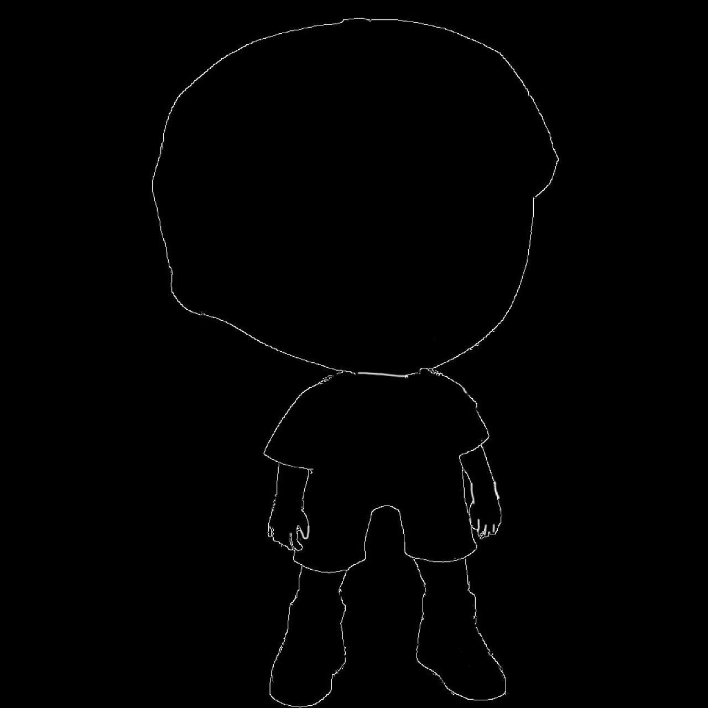
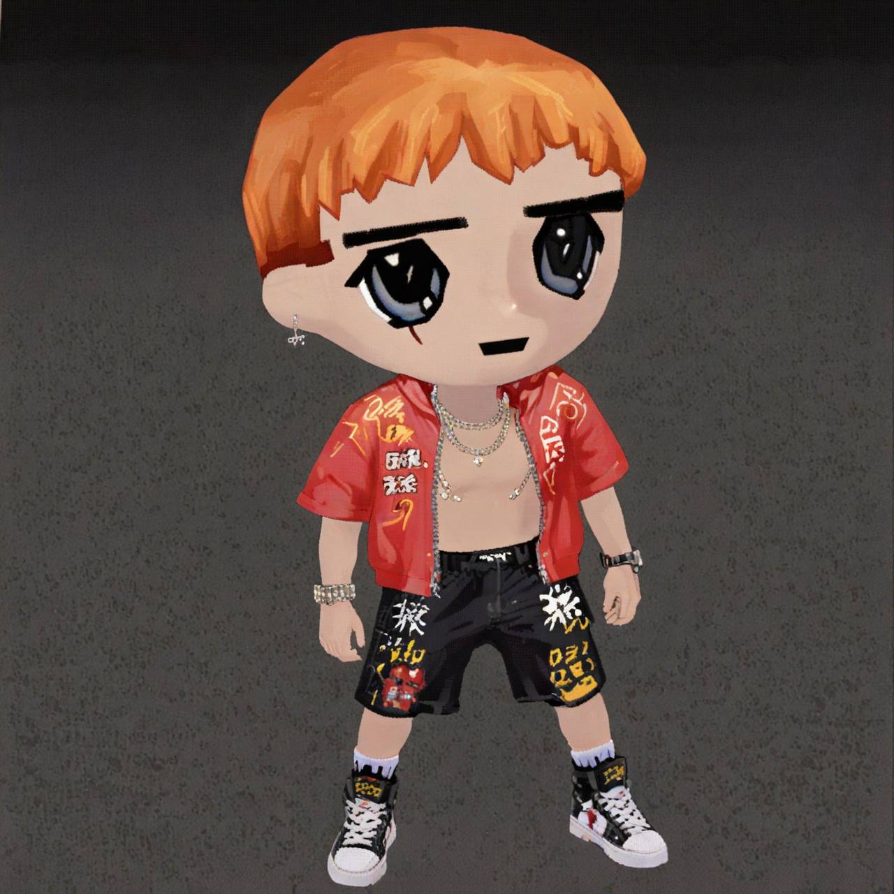
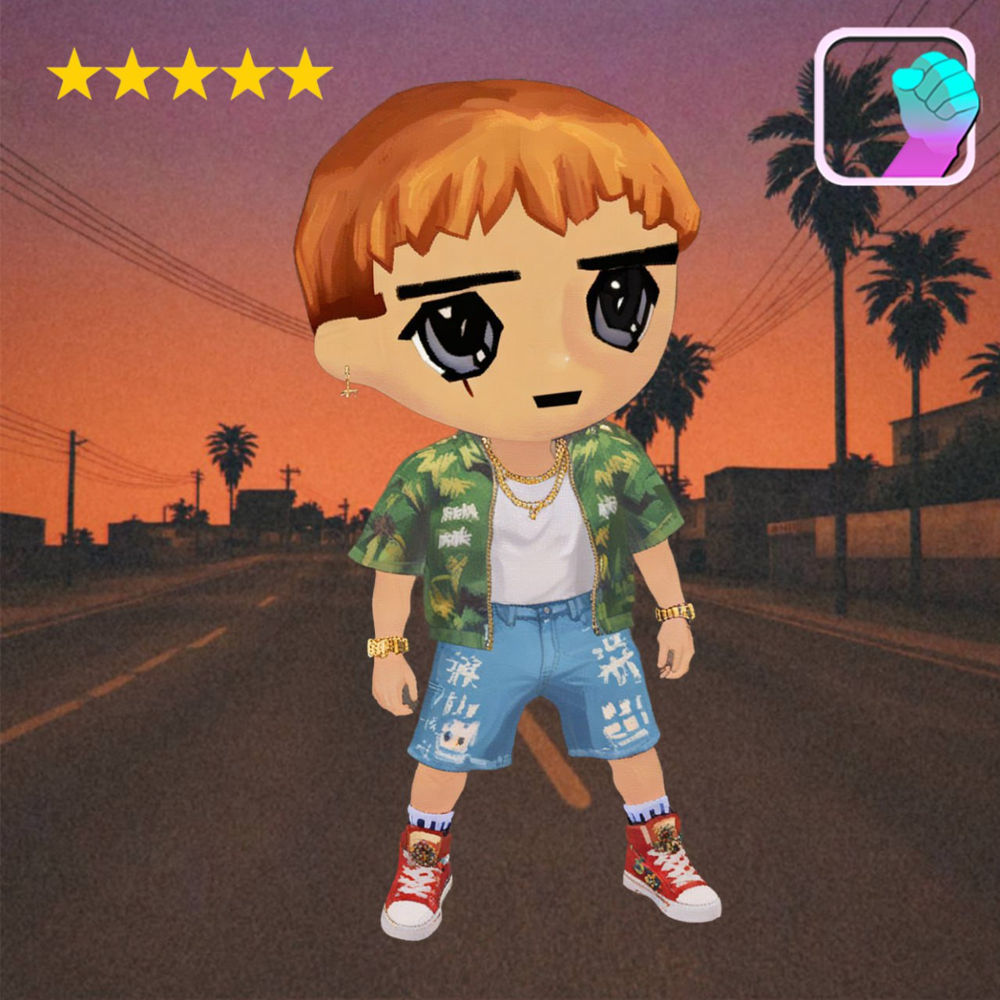

# NFT Art Generation

Welcome to the future of NFT creation. Introducing our advanced NFT Image Generator designed to revolutionize how digital art is conceived and realized.

<figure><figcaption></figcaption></figure> <figure><figcaption></figcaption></figure> <figure><figcaption></figcaption></figure>

## Use Cases

***

<strong>Artists looking for development support</strong>

Perfect for artists who are looking for developers to help bring their vision to life.

<strong>Creators looking to scale</strong>

Whether you’re an individual artist or a large studio, our generator can help you scale your NFT production efficiently.

<strong>Developers seeking higher quality output</strong>

Ideal for developers who want to ensure their NFT collections are produced to the highest standards.

## Traditional NFTs vs. Alphakek AI

***

| Feature         | Traditional NFTs                                                                                                                      | Alphakek AI                                                                                                                                                           |
| --------------- | ------------------------------------------------------------------------------------------------------------------------------------- | --------------------------------------------------------------------------------------------------------------------------------------------------------------------- |
| Methodology     | Individual traits must be designed and merged programmatically.                                                                       | We take your artwork and scale it via ever-improving advanced AI image models.                                                                                        |
| Uniqueness      | Although no two NFT is identical, every trait is identical across the collection are, losing a sense of individuality and uniqueness. | No trait is identical across the entire collection, making every image truly unique. Every image is like a 1:1, while retaining trait groupings and trait metadata.\* |
| Quality         | Limited to the artist's abilities.                                                                                                    | Our custom AI ensures each image is produced with the highest level of detail and clarity.                                                                            |
| Scale           | Number of traits limited by artist's capacity.                                                                                        | Produce an entire collection in a fraction of the time, with no compromise on quality.                                                                                |
| Speed           | Timeliness of trait design limited by artist's capacity.                                                                              | Generate a high-quality collection within hours, leaving you more time to focus on minting, marketing, and operations.                                                |
| Bulk Generation | No                                                                                                                                    | Yes                                                                                                                                                                   |

\*See [Criminalio](https://magiceden.io/marketplace/criminalio_) for reference.



## Benefits

***

Scale your vision effortlessly. Our NFT Image Generator offers a wide range of benefits designed to cater to both seasoned creators and newcomers in the NFT space.

* **No Code**: No need for extensive coding or blockchain skills. This service is ideal for artists looking to transition into the NFT space without the technical hurdles.
* **White Gloves**: Benefit from expert guidance on creative direction and trait development to ensure your NFT collection is unique and cohesive.
* **Prompt Controls**: Create NFTs using customized and descriptive prompts, for example, negative prompting. This enhances the quality of the final NFTs.

## Bulk Generation

***

* **Generate Multiple Images Quickly**: With our bulk generator, you can produce a variety of images at once, allowing you to select the best ones for your collection.
* **LaunchMyNFT-Compatible**: Our output includes images and metadata that are fully compatible with LaunchMyNFT, making the transition to blockchain seamless.
* **High-Fidelity Image Generation**: Our AI ensures each image is produced with the highest level of detail and clarity.


**How to Access**: Unlock the full potential of our NFT generator with our exclusive [Elite Tier](../guides/user-tiers.md). Contact us for more details.

