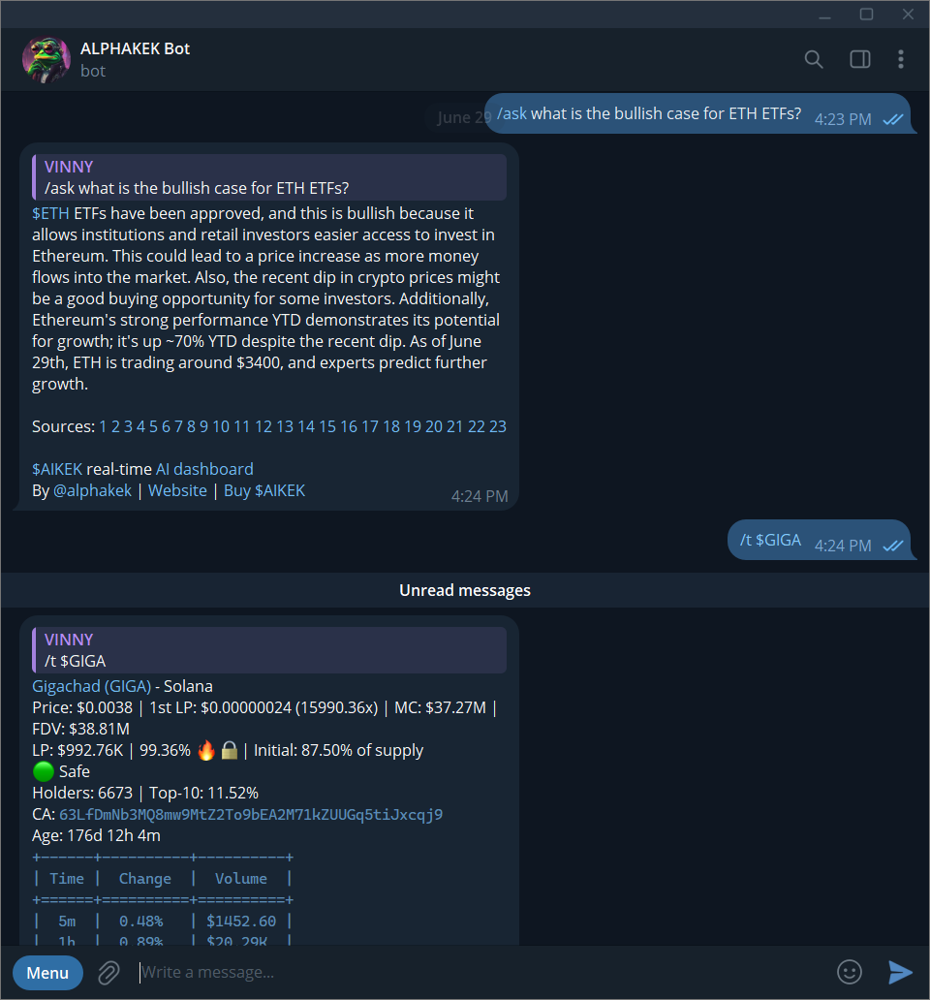

# AI Playground


Access Playground via [Telegram](https://t.me/alphakek_chat),  [Twitter (X)](https://x.com/aikek_agent), or [wizard-api.md](../developers/wizard-api.md "mention").



"Alpha Chat" has been renamed to "Playground".


The Playground is your AI copilot specifically designed for Web3 research and exploration, evolving strategically to meet the complex and fast-paced needs of the cryptocurrency landscape.

It offers real-time insights and tailored in-depth analyses, making it an essential tool for investors, traders, alpha hunters, and content creators within the dynamic Web3 ecosystem.


[bot-commands.md](../guides/bot-commands.md)


## **Features**

***

* **Uncensored Chat**: Open, unrestricted finance and crypto conversations that foster genuine creativity and innovation.
* **Comprehensive Database**: Leverages over 360,000+ documents (as of June 2025), including Crypto Twitter, mainstream sources like CNBC, niche segments like 4chan /biz/, and historical news dating back to September 2023.
* **On-chain Data**: Direct access to on-chain data and smart contract details.
* **Real-Time Updates**: Unlike other AI models with fixed knowledge cutoffs, Playground continuously updates its database to reflect the latest developments in the crypto world.
* **Diverse Use Cases**: Ideal for content generation, market analysis, educational purposes, and uncovering hidden opportunities in crypto and finance.

## **How to Get Started**

Simply type your query to start receiving tailored insights and analyses.

<figure><figcaption></figcaption></figure>


[wizard-api.md](../developers/wizard-api.md)

