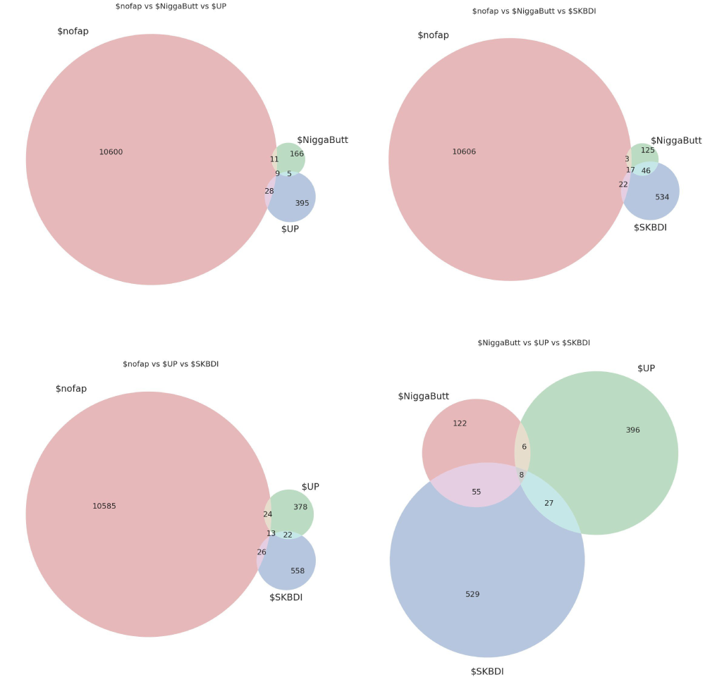
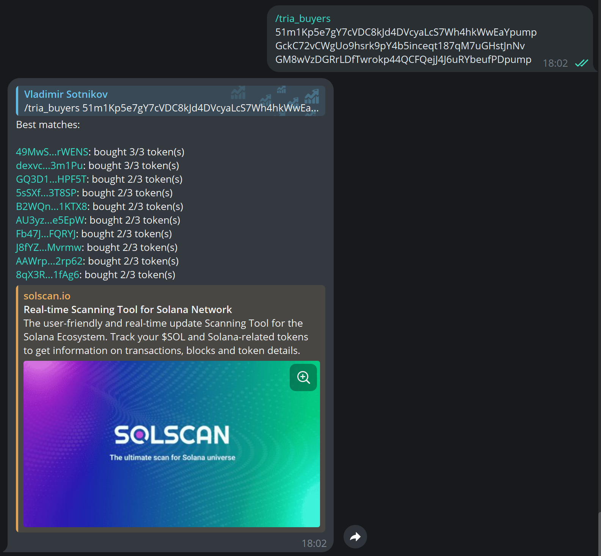
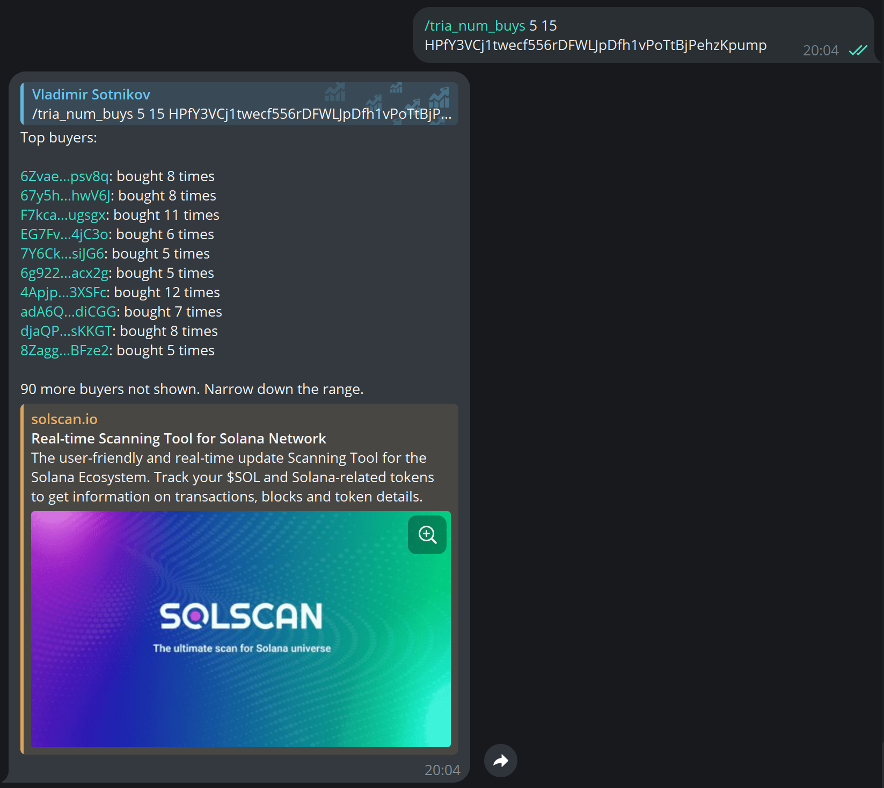

# Wallet Finder

Tracking wallet behavior across multiple tokens is one of the best ways to spot patterns, identify possible insider trading, and follow whales.

## Triangulator

***

<figure><figcaption></figcaption></figure>

<figure><figcaption></figcaption></figure>

The **Triangulator** is a set of advanced wallet-tracking features for finding insider trades and coordinated pushes.

<strong>Triangulator #1</strong>

Identify wallets involved in buying multiple tokens across various platforms on Solana. In other words, it shows you how different tokens are connected.

<mark style="color:blue;">**Use cases:**</mark>

* **Identify Cabals & Insider Wallets**: See which wallets are consistently involved across tokens, giving you valuable insights for potential copytrading or tracking coordinated efforts.
* **Audit Transactions**: Use it for tracking wallet behavior in more sophisticated audits or token analyses.

<mark style="color:blue;">**How it works:**</mark>

1. Use command `/find_buyers [CA1 CA2...]`, input up to **6 Solana token addresses**, and the Triangulator will show you wallets that have ever bought those tokens.
2. **Insights Provided**: You’ll receive a list of wallet addresses, linked to Solscan, along with a breakdown of how many tokens each wallet bought.
3. **Fuzzy Searching**: Get a ranked list of the top 10 matching wallets. If no wallets bought all tokens you queried, you’ll see those that bought 2, 3, or 4 tokens, making it easier to spot patterns when you're not certain about exact wallet matches.

<mark style="color:blue;">**Example:**</mark>

`/find_buyers EvNBoWwZFF6pPpjTnNSzrurxkDfw1PGUmih1eAStpump, BLdVQLXEzFzRJe9bXV9YoPEq4GKsGtgzGEefK9g7pump, 38zsUUgfkMCphWUwaT4b2YxGbG5uyXJNss9o8BdBWCBA, BprPz3BbG5dDqLoY1qYqnSadTEas54E5bi5MbyLAZr1x, EE3hEc8HTvVAwMeRxmqvmJpWGXx6p5YSx8DMKCTEpump`

<strong>Triangulator #2</strong>

Detect wallets based on the number of times they've bought a specific token, with precision.

<mark style="color:blue;">**Use Cases:**</mark>

Tracking wallets that have bought a token multiple times can give you valuable insights into **whale behavior** or **re-accumulation events**. Here's why it matters:

* **Find Whale Wallets Faster**: Identifying wallets that consistently buy the same token helps you focus on high-quality wallets rather than getting lost in the noise of occasional transactions.
* **Spot Re-Accumulation**: You can detect silent accumulation of tokens by wallets that are strategically re-entering positions multiple times, a signal often missed by casual observers.

With Triangulator #2, you can fine-tune your analysis, avoiding the clutter of irrelevant wallets, and zeroing in on key players in the market.

<mark style="color:blue;">**How it works:**</mark>

1. Simply enter the command `/find_num_buys min_count max_count contract_address` whereby:

* **min\_count**: Minimum number of purchases
* **max\_count**: Maximum number of purchases
* **contract\_address**: The address of the token you're interested in

In other words, specify the range of buys you’re interested in (e.g., wallets that bought between 5 and 15 times).

2. The tool will generate a list of wallet addresses, **ranked by the number of buys** they’ve made within your specified range.
3. Each result includes a **link to Dexscreener**, where you can view the wallet’s activity and explore the corresponding trades.
4. With this data, you’ll be able to identify strategic buyers and whale wallets—insight that could give you a competitive edge in your crypto trades.

<strong>Triangulator #3</strong>

Identify wallets based on the **size of a specific transaction** (in native token, SOL, or USD) for any given contract address.

<mark style="color:blue;">**Use cases:**</mark>

* You’re tracking a whale, influencer, or smart money wallet and know they purchased a specific amount of a token.
* You want to quickly identify the wallet behind this transaction without manually sifting through Solscan.

<mark style="color:blue;">**How it works:**</mark>

1. Use command `/find_buy_amount contract_address amount [max_amount] currency` whereby:

* **contract\_address**: Token contract address
* **amount**: Transaction amount (or a range)
* **currency**: Native token = sol, usd, $, or tokens

2. The tool will return a **list of best matches**, ranked by the closest transaction values.
3. This feature helps you track **smart money wallets** and analyze their behavior in real time. Long term, Alpha Alerts will fully automate smart money tracking.

<mark style="color:blue;">**Example:**</mark>

`/tria_buy_amount B2BsVuodH2eBGRnFckRYYW6yjur7Tn8cCxaSE2Xrnj5V 10 10.5 sol` to get buyers who bought 10-10.5 SOL worth of tokens

`/tria_buy_amount B2BsVuodH2eBGRnFckRYYW6yjur7Tn8cCxaSE2Xrnj5V 1264 1266` to get buyers who bought 1264-1266 tokens

Try it on Telegram now:


Alphakek AI Bot on Telegram


## User Limits

***

* **Premium**: 5 uses per day
* **Elite**: 30 uses per day


[user-tiers.md](guides/user-tiers.md)


This is just the beginning, with more advanced tools coming soon, like token/wallet clustering. In the meantime, you can manually use these tools to gain deeper insights into wallet behavior and token activity.
